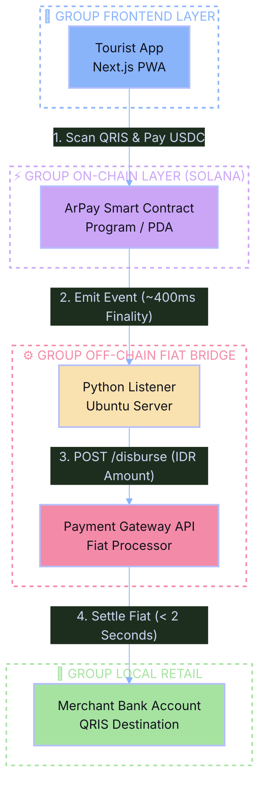
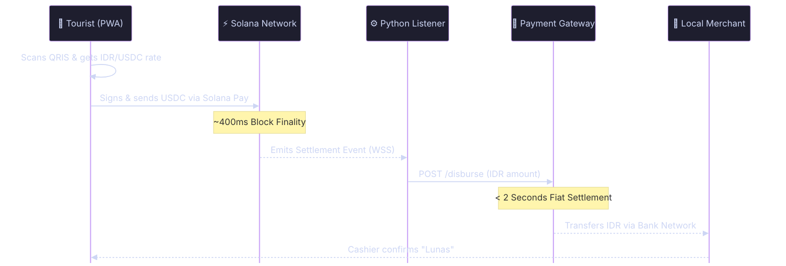

# 📖 ARPAY PROTOCOL

## 1. Abstract
ArPay Protocol is a decentralized, non-custodial settlement infrastructure built on the Solana blockchain. It enables real-time crypto-to-fiat off-ramping, bridging Web3 liquidity (USDC) directly to local QRIS (Quick Response Code Indonesian Standard) merchants. By leveraging Solana’s high throughput and sub-second finality, ArPay eliminates traditional cross-border remittance friction without requiring merchants to interact with crypto assets.

---

## 2. System Architecture
The ArPay ecosystem operates on a tri-layer architecture, ensuring a strict separation of concerns between user interfaces, on-chain state execution, and off-chain fiat settlement.

### 2.1. Client Layer (Next.js PWA)
The frontend is a lightweight, mobile-first Progressive Web App built with **Next.js**. 
* **QR Parsing:** Captures and decodes the national standard QR code payload to extract the `NMID` (National Merchant ID) and transaction amount.
* **Wallet Connection:** Integrates `@solana/wallet-adapter-react` to facilitate secure connection with browser-based wallets (Phantom, Solflare).
* **Solana Pay Integration:** Constructs standard Solana Pay URIs (`solana:...`) to prompt seamless transaction signing from the user.

### 2.2. On-Chain Layer (Solana Program)
The core logic resides in a custom Solana Program written in Rust/C++ using the Anchor framework.
* **Escrow PDA (Program Derived Address):** Funds (USDC) are temporarily locked in a PDA to prevent double-spending during the fiat settlement window.
* **Event Emission:** Upon successful USDC transfer, the program emits a structured event containing the `merchant_id`, `fiat_amount`, and `payer_pubkey`.

### 2.3. Oracle & Bridge Layer (Python & Ubuntu Environment)
The off-chain infrastructure handles the critical leap from Web3 to the legacy banking system.
* **WSS Listener:** A lightweight Python daemon running on a secure Ubuntu server environment maintains a persistent WebSocket connection to a Solana RPC node (e.g., Helius or QuickNode).
* **Tx Verification:** The listener filters for transactions interacting with the ArPay Program ID. Once a `Confirmed` or `Finalized` block status is achieved (typically < 1 second), it extracts the event data.
* **Fiat API Gateway:** The Python backend immediately fires an authenticated POST request to a licensed local Payment Gateway (e.g., Xendit) to disburse the exact IDR amount to the merchant's bank account.

---

## 3. Transaction Lifecycle (Sequence Flow)
The following represents the step-by-step execution of a standard ArPay transaction:

1. **Scan & Rate Fetch:** User scans QRIS. The PWA fetches the real-time USDC/IDR exchange rate via a decentralized Oracle (Pyth Network) or a reliable off-chain API.
2. **Sign Transaction:** The PWA prompts the user to sign a transaction transferring `X` USDC to the ArPay Program PDA.
3. **On-Chain Confirmation:** The Solana network processes the transaction. The Program emits a `SettlementRequested` event.
4. **Listener Trigger:** The Python listener detects the event via RPC WebSocket.
5. **Fiat Execution:** The listener calls the local Payment Gateway API: `POST /disbursements` with the merchant's bank details and the IDR amount.
6. **Merchant Notification:** The Payment Gateway settles the funds via the BI-FAST network. The merchant receives a standard banking notification of payment received.

---

## 4. Security & Compliance Assumptions
* **Non-Custodial for Users:** The protocol never holds user private keys. Users sign transactions directly from their self-custody wallets.
* **Atomic Off-Ramp:** The merchant receives fiat liquidity instantly. If the fiat API fails, the Python backend triggers a fallback mechanism to either retry the disbursement or trigger a refund instruction on the Solana Program.
* **Regulatory Isolation:** The protocol acts strictly as a technology bridge. Merchants exclusively receive legal tender (IDR), maintaining 100% compliance with local central bank regulations regarding payment instruments.

---

## 5. Future Roadmap: Enterprise POS Integration
ArPay is currently demonstrated as a standalone consumer PWA for the Colosseum Hackathon. The ultimate deployment phase (slated for August 2026) involves natively embedding the ArPay Protocol API into **HYDRA**—a comprehensive SaaS Point of Sales ecosystem. This integration will transform ArPay into an invisible, default Web3 inbound module for thousands of retail terminals, unlocking true mass adoption.

***

### Architecture

### Transaction Flow

---
### Please read details in [Our Official Whitepaper (PDF)](docs/ArPay_Whitepaper.pdf).
