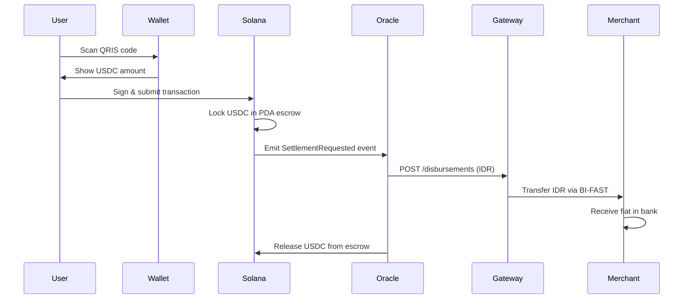

# ArPay Protocol Documentation

## Overview

ArPay is a **peer-to-fiat settlement protocol** that bridges the gap between cryptocurrency holders and traditional merchants. It enables seamless conversion of on-chain USDC to local fiat currency (IDR) without requiring merchants to interact with any cryptocurrency infrastructure.

## The Problem

Commerce between digital asset holders and traditional merchants faces a fundamental mismatch:

- **Merchants** operate exclusively within banking systems that recognize legal tender
- **Crypto holders** possess value in programmable, censorship-resistant tokens
- **No direct settlement** exists that satisfies both parties without forcing one to adopt the other's infrastructure

### Current Solutions Fall Short

  

    <h4 className="font-bold text-red-600">❌ Centralized Exchanges</h4>
    <ul className="text-sm mt-2 space-y-1">
      <li>• Require custody surrender</li>
      <li>• Mandatory KYC verification</li>
      <li>• Settlement delays (hours/days)</li>
    </ul>
  

  
  

    <h4 className="font-bold text-red-600">❌ Crypto POS Terminals</h4>
    <ul className="text-sm mt-2 space-y-1">
      <li>• Merchants bear regulatory exposure</li>
      <li>• Requires crypto knowledge</li>
      <li>• Near-zero adoption</li>
    </ul>
  

  
  

    <h4 className="font-bold text-red-600">❌ Payment Plugins</h4>
    <ul className="text-sm mt-2 space-y-1">
      <li>• Merchants must accept novel instruments</li>
      <li>• Complex integration</li>
      <li>• Limited merchant acceptance</li>
    </ul>
  

## The ArPay Solution

ArPay resolves this asymmetry through **protocol-level separation of concerns**:

  

    

       {/* SVG Icon */}
    

    

      {/* GANTI 
 JADI 
 DI SINI */}
      

        <strong>User-facing layer:</strong> Operates entirely on Solana blockchain
      

      

        <strong>Merchant-facing layer:</strong> Operates entirely within existing domestic banking
      

      

        <strong>Bridge:</strong> Cryptographically-verified Python daemon connects both layers
      

    

  

## Key Features

### ⚡ Lightning Fast Settlement
Complete settlement cycle from transaction signature to merchant bank credit in **3-6 seconds** under nominal network conditions.

### 🔒 Non-Custodial & Trustless
- Users maintain self-custody via standard Solana wallets
- Merchants never touch crypto—receive only legal tender
- No intermediary can freeze or confiscate funds

### 🛡️ Atomic Settlement Guarantee
**Formal guarantee:** Either the merchant receives fiat OR the user receives a full USDC refund. No intermediate state where funds are lost.

### 🏦 QRIS Native Integration
Leverages Indonesia's standardized QR payment system (QRIS) with 30M+ merchant terminals nationwide.

### 📊 Transparent & Auditable
All on-chain operations are publicly verifiable on Solana blockchain. Open-source smart contract code.

## How It Works (Simplified)

## Technical Highlights

| Component | Technology | Purpose |
|-----------|------------|---------|
| **Smart Contract** | Rust + Anchor 0.29 | Type-safe, auditable escrow logic |
| **Blockchain** | Solana Mainnet | Sub-second finality, 65K+ TPS |
| **Frontend** | Next.js 14 PWA | Mobile-first, no app install required |
| **Stablecoin** | USDC (SPL Token) | Price-stable, regulated, liquid |
| **Oracle** | Pyth Network | First-party on-chain price feeds |
| **Bridge** | Python 3.11 + asyncio | Event listener & fiat dispatcher |
| **Payment Rail** | BI-FAST | Indonesia instant transfer network |
| **Payment Gateway** | Xendit API | Licensed OJK processor |

## Performance Metrics

Under nominal conditions on Solana Mainnet-Beta with premium RPC:

| Stage | P50 Latency | P99 Latency |
|-------|-------------|-------------|
| QR Scan → Wallet Prompt | `<500ms` | `<1,200ms` |
| Wallet Sign → Block Confirmed | `400ms` | `1,200ms` |
| Block Confirmed → Event Received | `80ms` | `400ms` |
| Event → Gateway API Response | `300ms` | `900ms` |
| Gateway → BI-FAST Credit | `800ms` | `2,000ms` |
| **Total (End-to-End)** | **~2.5s** | **~6.0s** |

## Target Market

**Primary:** Indonesia — 30M+ QRIS merchants, 270M+ population, high mobile penetration

**Generalizable:** Any market with:
- Standardized QR payment scheme
- Licensed Payment Gateway API
- Instant fiat settlement network

## Use Cases

1. **Cross-border remittances** — Send USDC globally, receiver gets local fiat instantly
2. **Crypto spending** — Use crypto holdings for everyday purchases without merchant onboarding
3. **Tourism** — Visitors pay with crypto, merchants receive local currency
4. **Freelancer payments** — Receive crypto wages, spend as fiat instantly
5. **Merchant adoption** — Zero-risk crypto acceptance for traditional businesses

## Getting Started

  <a href="/developer" className="block p-6 border rounded-lg hover:shadow-lg transition">
    <h3 className="text-xl font-bold mb-2">👨‍💻 For Developers</h3>
    
Integrate ArPay, run the oracle, deploy smart contracts

  </a>
  
  <a href="#" className="block p-6 border rounded-lg hover:shadow-lg transition">
    <h3 className="text-xl font-bold mb-2">🏪 For Merchants</h3>
    
Accept crypto payments without touching crypto

  </a>
  
  <a href="/architecture" className="block p-6 border rounded-lg hover:shadow-lg transition">
    <h3 className="text-xl font-bold mb-2">🏗️ Architecture</h3>
    
Deep dive into tri-layer protocol design

  </a>
  
  <a href="/security" className="block p-6 border rounded-lg hover:shadow-lg transition">
    <h3 className="text-xl font-bold mb-2">🔐 Security</h3>
    
Fund safety, oracle manipulation, formal guarantees

  </a>

## Project Status

  <h4 className="font-bold text-green-800 mb-2">✅ Completed</h4>
  <ul className="space-y-1 text-sm text-green-700">
    <li>• Solana smart contract deployed on mainnet</li>
    <li>• PWA frontend with Solana Pay integration</li>
    <li>• Oracle bridge with WebSocket event listener</li>
    <li>• Xendit API integration for fiat disbursement</li>
    <li>• End-to-end testing on Solana devnet</li>
  </ul>

  <h4 className="font-bold text-yellow-800 mb-2">🚧 In Progress</h4>
  <ul className="space-y-1 text-sm text-yellow-700">
    <li>• Mainnet beta testing with pilot merchants</li>
    <li>• Formal security audit of smart contract</li>
    <li>• Mobile app (iOS/Android native)</li>
  </ul>

## Open Source

ArPay is open-source and contributions are welcome:

- **Smart Contract:** [github.com/arpay/smart-contract](https://github.com)
- **Frontend:** [github.com/arpay/frontend](https://github.com)
- **Oracle Bridge:** [github.com/arpay/oracle-bridge](https://github.com)

## Support & Contact

- **Website:** [www.arpay.net](https://www.arpay.net)
- **Email:** arshaka@gmail.com
- **Documentation:** You're reading it! 📖
- **Discord:** [Join our community](https://discord.gg)
- **Twitter:** [@ArPayProtocol](https://twitter.com)

---

  ArPay, Indonesia 🇮🇩

