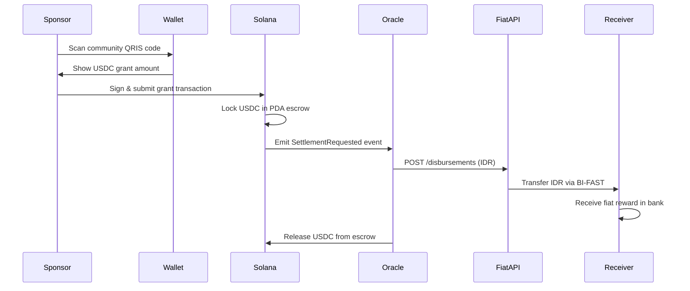

# ArPay Protocol Documentation

## Overview

ArPay is an **eco-incentive settlement protocol** that bridges the gap between Web3 sustainability sponsors and local communities. It enables the seamless conversion of on-chain environmental grants (USDC) to local fiat currency (IDR) without requiring receiving communities to interact with any cryptocurrency infrastructure.

## The Problem

Funding for local green initiatives faces a fundamental mismatch:

- **Local Communities** operate exclusively within banking systems that recognize legal tender.
- **Eco-sponsors & DePIN networks** possess value in programmable, globally verifiable tokens.
- **No direct settlement** exists that satisfies both parties without forcing communities to understand crypto wallets or adopt the other's infrastructure.

### Current Solutions Fall Short

  

    <h4 className="font-bold text-red-600">❌ Centralized Exchanges</h4>
    <ul className="text-sm mt-2 space-y-1">
      <li>• Require custody surrender</li>
      <li>• Mandatory KYC verification</li>
      <li>• Settlement delays (hours/days)</li>
    </ul>
  

  
  

    <h4 className="font-bold text-red-600">❌ Crypto POS Terminals</h4>
    <ul className="text-sm mt-2 space-y-1">
      <li>• Communities bear regulatory exposure</li>
      <li>• Requires crypto knowledge</li>
      <li>• Near-zero adoption</li>
    </ul>
  

  
  

    <h4 className="font-bold text-red-600">❌ Grant Plugins</h4>
    <ul className="text-sm mt-2 space-y-1">
      <li>• Communities must accept novel instruments</li>
      <li>• Complex integration</li>
      <li>• Limited community acceptance</li>
    </ul>
  

## The ArPay Solution

ArPay resolves this asymmetry through **protocol-level separation of concerns**:

  

    

       {/* SVG Icon */}
    

    

      

        <strong>Sponsor-facing layer:</strong> Operates entirely on Solana blockchain
      

      

        <strong>Community-facing layer:</strong> Operates entirely within existing domestic banking
      

      

        <strong>Bridge:</strong> Cryptographically-verified Python daemon connects both layers
      

    

  

## Key Features

### ⚡ Lightning Fast Settlement
Complete settlement cycle from grant signature to community bank credit in **3-6 seconds** under nominal network conditions.

### 🔒 Non-Custodial & Trustless
- Sponsors maintain self-custody via standard Solana wallets
- Communities never touch crypto—receive only legal tender
- No intermediary can freeze or confiscate funds

### 🛡️ Atomic Settlement Guarantee
**Formal guarantee:** Either the community receives fiat OR the sponsor receives a full USDC refund. No intermediate state where funds are lost.

### 🏦 QRIS Native Integration
Leverages Indonesia's standardized QR settlement system (QRIS) with 30M+ community endpoints nationwide.

### 📊 Transparent & Auditable
All on-chain operations are publicly verifiable on Solana blockchain. Open-source smart contract code for ESG reporting.

## How It Works (Simplified)

## Technical Highlights

| Component | Technology | Purpose |
|-----------|------------|---------|
| **Smart Contract** | Rust + Anchor 0.29 | Type-safe, auditable grant escrow |
| **Blockchain** | Solana Mainnet | Sub-second finality, 65K+ TPS |
| **Frontend** | Next.js 14 PWA | Mobile-first, no app install required |
| **Stablecoin** | USDC (SPL Token) | Price-stable, regulated, liquid |
| **Oracle** | Pyth Network | First-party on-chain price feeds |
| **Bridge** | Python 3.11 + asyncio | Event listener & fiat dispatcher |
| **Settlement Rail** | BI-FAST | Indonesia instant transfer network |
| **Fiat Disbursement API** | Xendit API | Licensed OJK processor |

## Performance Metrics

Under nominal conditions on Solana Mainnet-Beta with premium RPC:

| Stage | P50 Latency | P99 Latency |
|-------|-------------|-------------|
| QR Scan → Wallet Prompt | `<500ms` | `<1,200ms` |
| Wallet Sign → Block Confirmed | `400ms` | `1,200ms` |
| Block Confirmed → Event Received | `80ms` | `400ms` |
| Event → Fiat API Response | `300ms` | `900ms` |
| Fiat API → BI-FAST Credit | `800ms` | `2,000ms` |
| **Total (End-to-End)** | **\~2.5s** | **\~6.0s** |

## Target Market

**Primary:** Indonesia — 30M+ QRIS community endpoints, 270M+ population, high mobile penetration

**Generalizable:** Any market with:

  - Standardized QR settlement scheme
  - Licensed Fiat Disbursement API
  - Instant fiat settlement network

## Use Cases

1.  **DePIN Sensor Rewards** — Solar or waste-tracking sensors automatically trigger fiat payouts to host communities.
2.  **Carbon Credit Disbursements** — Direct fiat incentives to individuals participating in recycling programs.
3.  **NGO Grant Distribution** — Transparent, on-chain tracking of volunteer operational funds.
4.  **Eco-Tourism** — Visitors sponsor local conservation efforts effortlessly via QRIS.

## Getting Started

<a href="/developer" className="block p-6 border border-green-500/30 bg-green-500/5 rounded-lg hover:shadow-lg transition">
<h3 className="text-xl font-bold mb-2 text-green-400">👨💻 For Developers</h3>

Integrate ArPay, run the oracle, deploy smart contracts

</a>

<a href="#" className="block p-6 border border-green-500/30 bg-green-500/5 rounded-lg hover:shadow-lg transition">
<h3 className="text-xl font-bold mb-2 text-green-400">🌿 For Communities</h3>

Accept green grants without touching crypto

</a>

<a href="/architectur" className="block p-6 border border-white/10 rounded-lg hover:shadow-lg transition">
<h3 className="text-xl font-bold mb-2">🏗️ Architecture</h3>

Deep dive into tri-layer protocol design

</a>

<a href="/security" className="block p-6 border border-white/10 rounded-lg hover:shadow-lg transition">
<h3 className="text-xl font-bold mb-2">🔐 Security</h3>

Fund safety, oracle manipulation, formal guarantees

</a>

## Project Status

<h4 className="font-bold text-green-400 mb-2">✅ Completed</h4>
<ul className="space-y-1 text-sm text-green-200/70">
<li>• Solana smart contract deployed on mainnet</li>
<li>• PWA frontend with Solana Pay integration</li>
<li>• Oracle bridge with WebSocket event listener</li>
<li>• Xendit API integration for fiat disbursement</li>
<li>• End-to-end testing on Solana devnet</li>
</ul>

<h4 className="font-bold text-yellow-400 mb-2">🚧 In Progress</h4>
<ul className="space-y-1 text-sm text-yellow-200/70">
<li>• Mainnet beta testing with eco-initiatives</li>
<li>• Formal security audit of smart contract</li>
<li>• DePIN hardware sensor integration</li>
</ul>

## Open Source

ArPay is open-source and contributions are welcome:

  - **Smart Contract:** [github.com/arpay/smart-contract](https://github.com)
  - **Frontend:** [github.com/arpay/frontend](https://github.com)
  - **Oracle Bridge:** [github.com/arpay/oracle-bridge](https://github.com)

## Support & Contact

  - **Website:** [www.arpay.my.id](https://www.arpay.my.id)
  - **Email:** arshaka@zohomail.com
  - **Documentation:** You're reading it! 📖
  - **Discord:** [Join our community](https://discord.gg)
  - **Twitter:** [@ArPayProtocol](https://twitter.com)

---

Arshaka Team, Malang, Indonesia 🇮🇩

